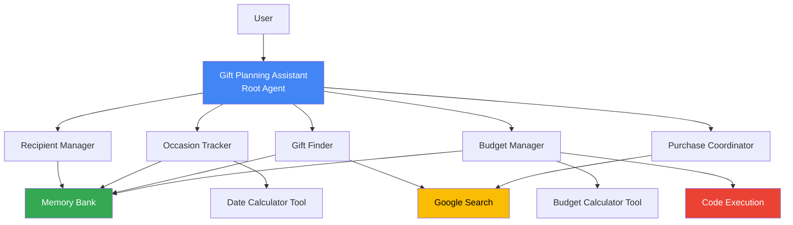

# 🎁 Gift Planning Assistant

A comprehensive multi-agent AI system built with Google's Agent Development Kit (ADK) and Gemini 2.0 Flash to help you manage all aspects of gift-giving.

## 📋 Table of Contents

- [Problem Statement](#problem-statement)
- [Solution](#solution)
- [Architecture](#architecture)
- [Features](#features)
- [Technical Stack](#technical-stack)
- [Setup Instructions](#setup-instructions)
- [Usage](#usage)
- [ADK Features Used](#adk-features-used)
- [Project Structure](#project-structure)
- [Future Enhancements](#future-enhancements)

## 🎯 Problem Statement

Gift-giving can be challenging due to:
- **Forgetting important occasions** (birthdays, anniversaries, holidays)
- **Lack of personalization** - generic gifts that don't match recipient interests
- **Budget management** - overspending or poor allocation across recipients
- **Time-consuming research** - finding the perfect gift takes hours
- **No gift history tracking** - accidentally giving duplicate gifts

## 💡 Solution

The Gift Planning Assistant is an intelligent multi-agent system that:
- **Remembers** all your recipients and their preferences
- **Tracks** important occasions with smart reminders
- **Suggests** personalized gifts based on interests, age, and past gifts
- **Manages** your budget and spending across all recipients
- **Finds** the best prices and purchase options automatically

## 🏗️ Architecture

The system uses a **multi-agent architecture** coordinated through ADK's tool-based pattern:



### System Components

**1. Root Agent (ADK Agent)**
- Gemini 2.0 Flash agent that coordinates all specialized capabilities
- Equipped with 10 custom FunctionTools for gift planning workflows
- Orchestrates multi-agent collaboration through tool invocation

**2. Specialized Agents (via FunctionTools)**

The system implements 5 specialized agents, each exposed through dedicated FunctionTools:

- **RecipientManagerAgent** 
  - Tools: `add_recipient_profile`, `list_recipients`
  - Manages recipient profiles (name, age, interests, relationship)
  - Stores gift history to avoid duplicates
  - Tracks preferences and style

- **OccasionTrackerAgent**
  - Tools: `add_occasion_for_recipient`, `list_upcoming_occasions`, `calculate_days_until_event`
  - Tracks birthdays, anniversaries, holidays, custom events
  - Calculates days until occasions
  - Manages reminder schedules

- **GiftFinderAgent** 
  - Tool: `generate_gift_ideas`
  - Analyzes recipient profiles for personalization
  - Uses Google Search to find current gift ideas
  - Filters by budget and past gifts

- **BudgetManagerAgent**
  - Tools: `set_total_budget`, `record_gift_expense`, `get_budget_status`
  - Sets and tracks overall gift budget
  - Monitors spending per recipient
  - Uses Code Execution for precise calculations
  - Alerts on budget limits

- **PurchaseCoordinatorAgent**
  - Tool: `find_purchase_options`
  - Searches for product availability
  - Compares prices across retailers
  - Provides purchase links

**3. Memory Bank**
- Session-based persistence using ADK's ToolContext state
- Stores recipients, occasions, and budget data
- Maintains context across conversation turns
- Shared memory accessible to all agents

**4. External Tools**
- **Google Search** - Real-time gift and price discovery
- **Code Execution** - Precise budget calculations
- **Custom Calculators** - Date and budget utilities

## ✨ Features

### Core Capabilities

- ✅ **Multi-Agent System** - 5 specialized agents coordinated through FunctionTools
- ✅ **Google Search Integration** - Real-time gift and price searches
- ✅ **Code Execution** - Precise budget calculations
- ✅ **Custom Tools** - Date calculator, budget analyzer
- ✅ **Memory Bank** - Session-based storage of recipients, occasions, budgets
- ✅ **Session Management** - InMemorySessionService for conversation context
- ✅ **Gemini 2.0 Flash** - Latest Gemini model for advanced reasoning

### User Features

- 📝 Add and manage recipient profiles
- 📅 Track occasions with automatic reminders
- 🎁 Get personalized gift suggestions
- 💰 Set budgets and track spending
- 🛒 Find best prices across retailers
- 💬 Chat interface for natural interaction
- 📊 View statistics and summaries

## 🛠️ Technical Stack

- **Framework**: Google Agent Development Kit (ADK) for Python
- **Model**: `gemini-2.0-flash` (Gemini 2.0 Flash)
- **Language**: Python 3.10+
- **Tools**: Google Search, Code Execution, Custom Tools
- **Memory**: InMemorySessionService + Memory Bank pattern
- **Dependencies**: 
  - `google-genai` - Gemini API client
  - `google-generativeai` - Generative AI library
  - `python-dotenv` - Environment management
  - `pydantic` - Data validation

## 🚀 Setup Instructions

### Prerequisites

- Python 3.10 or higher
- Gemini API key (get one at [Google AI Studio](https://makersuite.google.com/app/apikey))
- Git (optional)

### Installation

1. **Clone or download the project**
   ```bash
   cd "Gift Planning Agent"
   ```

2. **Create a virtual environment** (recommended)
   ```bash
   python -m venv venv
   source venv/bin/activate  # On Windows: venv\Scripts\activate
   ```

3. **Install dependencies**
   ```bash
   pip install -r requirements.txt
   ```

4. **Configure environment variables**
   Create a `.env` file inside `gift_planning_assistant/` (there is no template in the repo):
   ```bash
   cat <<'EOF' > gift_planning_assistant/.env
   GEMINI_API_KEY=your_actual_api_key_here
   EOF
   ```
   Replace the value with your Gemini key from Google AI Studio.

5. **Verify installation**
   ```bash
   python -c "import google.genai; print('✓ Installation successful')"
   ```

## 📖 Usage

### Option 1: CLI Interface

Run the interactive command-line interface:

```bash
python main.py
```

This launches a menu-driven interface with options:
1. Add Recipient
2. Add Occasion
3. Get Gift Suggestions
4. View Budget Summary
5. View Upcoming Occasions
6. Chat with Assistant
7. View Statistics
8. Exit

### Option 2: ADK Web Interface

Run the web interface (if ADK CLI is installed):

```bash
adk web
```

Then open your browser to interact with the assistant via a web UI.

### Option 3: ADK Run (Programmatic)

Run the agent programmatically:

```bash
adk run
```

### Option 4: FastAPI / Cloud Run API

Run the HTTP server locally (uses the same ADK agent under the hood):

```bash
uvicorn server:app --reload
```

Send a test request:

```bash
curl -X POST http://127.0.0.1:8000/chat \
  -H "Content-Type: application/json" \
  -d '{"message": "Help me plan a gift", "user_id": "demo"}'
```

## ☁️ Deploying to Cloud Run

1. **Build the container locally (optional)**
   ```bash
   docker build -t gift-agent .
   docker run -p 8080:8080 -e GEMINI_API_KEY=your_key gift-agent
   ```
2. **Configure gcloud**
   ```bash
   gcloud auth login
   gcloud config set project YOUR_PROJECT_ID
   gcloud services enable run.googleapis.com artifactregistry.googleapis.com
   ```
3. **Submit build to Cloud Build**
   ```bash
   gcloud builds submit --tag gcr.io/YOUR_PROJECT_ID/gift-agent
   ```
4. **Deploy to Cloud Run**
   ```bash
   gcloud run deploy gift-agent \
     --image gcr.io/YOUR_PROJECT_ID/gift-agent \
     --platform managed \
     --region us-central1 \
     --allow-unauthenticated \
     --set-env-vars GEMINI_API_KEY=YOUR_GEMINI_KEY
   ```
5. **Test the deployed endpoint**
   ```bash
   curl -X POST https://gift-agent-<hash>-uc.a.run.app/chat \
     -H "Content-Type: application/json" \
     -d '{"message": "Hi there!"}'
   ```

Use Secret Manager (`--set-secrets`) instead of plain env vars for production deployments.

## 🖥️ Custom Web UI

The `/webui` folder contains a lightweight React single-page app. When the Docker image builds, it automatically runs `npm install && npm run build`, and the FastAPI server serves the compiled assets.

- **Local dev**
  ```bash
  cd webui
  npm install
  npm start   # launches React dev server on port 3000
  ```
- **Build for server**
  ```bash
  npm run build
  ```

When the build output exists (`webui/build`), visiting the Cloud Run URL in a browser loads the SPA; all AJAX calls hit the same origin via the `/chat` endpoint.
